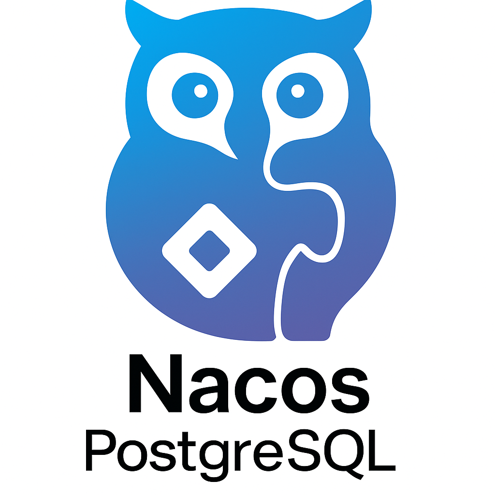

# Nacos PostgreSQL 数据源集成（2.5.1 版本）

**基于 Nacos 2.5.1 的 PostgreSQL 数据源插件，支持配置中心与注册中心持久化存储**

---

## 📝 简介
本项目基于Nacos 2.5.1 集成PostgreSQL数据源插件。

---

## 🛠️ 环境要求
| 组件       | 版本要求          |
|------------|-------------------|
| Nacos      | 2.5.1+            |
| PostgreSQL | 14.0+             |
| Java       | JDK 8+            |
| Maven      | 3.5.0+            |

---

## 🚀 快速开始

### 1. 下载与构建
```bash
git clone https://github.com/ebrx/nacos-postgresql-2.5.1.git
cd nacos-postgresql-2.5.1
mvn -Prelease-nacos -Dmaven.test.skip=true clean install -U
```

### 2. 配置修改
在 `distribution/conf/application.properties` 中配置：
```properties
# 数据源配置
spring.datasource.platform=postgresql
db.num=1
db.url.0=jdbc:postgresql://localhost:5432/nacos_config
db.user=postgres
db.password=your_password

# 连接池配置
db.pool.config.driver-class-name=org.postgresql.Driver
db.pool.config.max-active=200
db.pool.config.max-idle=50
```

### 3. 初始化数据库
执行 SQL 脚本（位于 `distribution/conf/postgres-schema.sql`）：
```sql
CREATE DATABASE nacos_config WITH OWNER = postgres;
GRANT ALL PRIVILEGES ON DATABASE nacos_config TO postgres;
```

### 4. 启动验证
```bash
sh bin/startup.sh -m standalone
```
访问 `http://localhost:8848/nacos` 验证控制台

---

## 📜 配置说明
| 配置项                | 说明                          | 默认值       |
|-----------------------|-------------------------------|-------------|
| `spring.sql.init.platform` | 数据源类型（postgresql/mysql） | postgresql  |
| `db.url.0`            | PostgreSQL 连接URL            | 无          |
| `db.user`             | 数据库用户名                  | postgres    |
| `db.password`         | 数据库密码                    | 无          |
| `db.pool.config.*`    | HikariCP 连接池参数           | 见配置文件  |

---

## ⚠️ 注意事项
1. **分页查询适配**  
   PostgreSQL 使用 `LIMIT offset, count` 语法，已自动适配 Nacos 分页逻辑
2. **集群部署**  
   需确保所有节点使用相同 PostgreSQL 实例
3. **字符编码**  
   建议数据库使用 UTF-8 编码
   
---

## 📄 文档参考
- [Nacos 官方数据源文档](https://nacos.io/docs/latest/manual/admin/auth/)
- [PostgreSQL JDBC 驱动文档](https://jdbc.postgresql.org/documentation/)

---

**项目地址**  
[GitHub Repository](https://github.com/ebrx/nacos-postgresql-2.5.1)  
**问题反馈**  
[GitHub Issues](https://github.com/ebrx/nacos-postgresql-2.5.1/issues)

---
